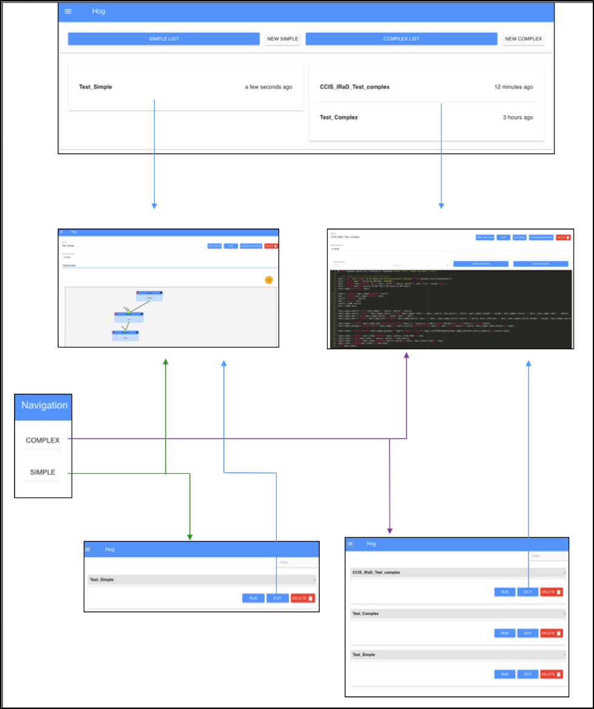

# Integrated Development Environment "Hog" User Manual

# Introduction

This Interactive Development Environment (codename: Hog) allows for the creation
of Apache Pig scripts.

The Simple interface allows users to create scripts without the knowledge of Pig
syntax using drag and drop functions. The Complex interface is an all-inclusive
development environment to write, store and run scripts that the user has
created – even if those scripts were not made using the Simple interface. Hog
can display log, numerical and graphical output.

This manual will provide the user with detailed instructions of Hog’s various
features and how to leverage them.

# Installation

To install Hog, follow the instructions laid out in the
[Hog Installation Guide](./InstallationGuide.md).

# Design

**Landing Page**

The landing page shows the user the last five complex and the last five simple
scripts that were edited and the time they were edited. From this page the user
can click on a script to view it in edit mode, list view, or create a new
script.

**Simple Page**

*New*

The Simple New page allows the user to create new scripts by using a drag and
drop interface. The user can select from a number of pre-entered Pig functions
to create a script without in-depth knowledge of the language; this page enters
all the syntax in automatically.

To begin, there are two fields located at the top of the page: Name and Pig
Arguments. The Name field will be the title of the new script (note that any
space characters will be replaced by underscores once saved). The Pig Arguments
field allows the user to pass in command line arguments to the Pig binary.

The ‘+’ sign will enable the user to add Nodes and begin creating their Pig
script. For a list of available Nodes and their functions, see “Node Functions”.

Once nodes have been created, the user may connect them how they desire, or
immediately can hit the Save button, which will save the new script and bring
the user to the Simple Edit page. Note that the Save button will only be
available once all the fields have been supplemented.

*Edit*

The Simple Edit page allows the user to edit, run and save settings associated
with the script strictly by adding or removing nodes. The user can edit all
areas of the script including the command line arguments, the name as well as
the script itself.

The Edit page retains the information that was input in the New page when the
script was created. The Name, Pig Arguments, Nodes will all be available for
editing.

From this page, users may run their script by clicking the Run button. By
running the script, Outputs will be generated (see “Outputs”). To stop the
compiler, click the Kill button.
Another feature on the Simple Edit page is the Complex Script Viewer tab. This
tab will allow scripts created by the Simple page to be viewed in code form. It
can take users to the Complex Edit page (see Complex Page), as well as give the
user the option to delete their script entirely.

*List*

The Simple List page shows all the scripts the user has created with the Simple
interface. They are listed on the page with two buttons, Run and Edit.

The user is able to quickly and conveniently run the scripts from this page. All
output from running scripts will show in a modal as it does on other pages.

Attempting to edit the script will take the user to the Simple Edit page.

In the bottom right hand corner of the page is a plus sign. When clicked the
user will be taken to the new script page to create a new simple script.

The drop down menu will allow scripts to be viewed in their Complex view, as
well as allowing the user to delete the scripts.

Scripts are sorted alphabetically. The user may also use the filter to find the
desired script.

**Complex Page**

*New*

The Complex New page allows the user to create new Pig scripts in a traditional
environment. Similar to the Simple New page, this page contains Name and Pig
Argument fields, along with a Save button that will take you to the Complex Edit
page.

Unique to this New page is the ability to upload a script to Hog.

Once the script is saved, the Complex Edit page will appear.

*Edit*

The Complex Edit page allows the user to edit all branches of the script,
including the name, command line arguments, settings associated with the output
and the script itself. is designed for more experienced users, as there is no
drag and drop node editing available on this page.

Features of the Edit page include autocomplete functions and colored font for
usability. The script can be run and outputs are displayed in a modal from this
page. The user may also download the script they created by selecting the
Download/Export button.

By clicking the Settings button, users may toggle which graphs they would like
to see when the Output is produced. They may also delete the script from this
modal.

*List*

The Complex List page displays all scripts the user has written on both the
Simple and Complex interfaces. From this page, the user can select a script and
be taken to the Complex Edit page to either run or edit it.

Scripts are sorted alphabetically. The user may also use the filter to find the
desired script.

Similar to the Simple List page, there is a plus sign in the bottom right corner
that, when clicked, the user will be taken to the new script page to create a
new complex script.

**Outputs**

There are 5 different types of outputs displayed by running a Pig script on Hog:

- **Results**: All of the outputs that have been successfully output by the
  script
- **Info Logs**: Indicators of the progress that is being made while the script
  is running
- **Warnings**: Abnormalities that were detected while running the script, but
  will not prevent the script from completing
- **Errors**: Issues that were detected while running the script that causes its
  compilation to cease
- **Graphs**: Creates various graphs from the Results outputs (see ‘Show
  Graphs’)

Additionally, users may opt to “Show All”, which shows a color-coded display of
all of the various types of log outputs in one view.

**Show Graphs**

Hog has the ability to display various graphs, using information from the
results output and displaying the ones that are able to be displayed
graphically.

Graphs may be filtered by the number of outputs. Via the Settings Tab, the Data
Layout field also provides the ability to assign the x and y indices to specific
values, as well as switching between number of outputs filters.

While viewing the graph, the slider allows for alterations to the number of
outputs to be displayed.

# Node Functions

Descriptions of the different Pig Node Functions utilized in Hog:

**Relational Operators**

- Cross
  - Computes the cross product of two or more relations
- Initial Cube
  - Performs cube/rollup operations
- Cube
  - Cube operation computes aggregates for all possible combinations of
    specified group by dimensions. The number of group combinations generated by
    cube for n dimensions will be 2^n
- Rollup
  - Rollup operations computes multiple levels of aggregates based on
    hierarchical ordering of specified group by dimensions. Rollup is useful
    when there is hierarchical ordering on the dimensions.
- Distinct
  - Removes duplicate tuples in a relation
- Filter
  - Selects tuples from a relation based on some condition
- Group
  - Takes in an input and groups by a type
- Join
  - Performs an inner join of two or more relations based on common field values
- Limit
  - Limits the number of outputs tuples
- OrderBy
  - Sorts a relation based on one or more fields
- Rank
  - Returns each tuple with the rank within a relation
- Sample
  - Selects a random sample of data based on the specified sample size
- Stream
  - Sends data to an external script or program
- Union
  - Computes the union of two or more relations

**Eval Functions**

