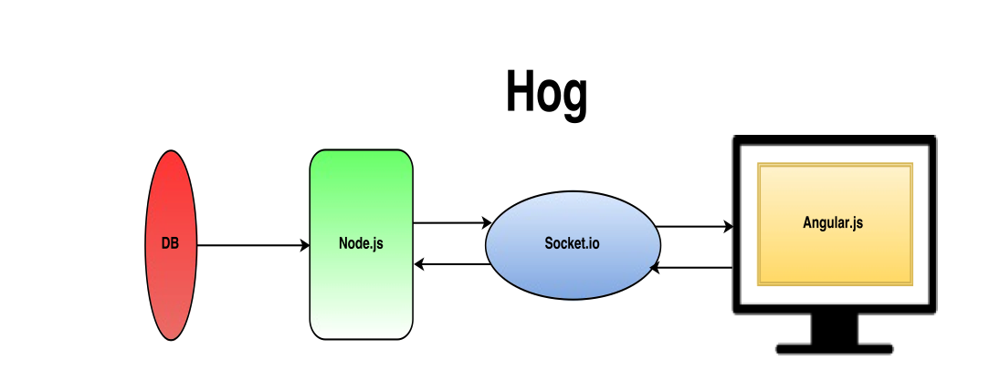
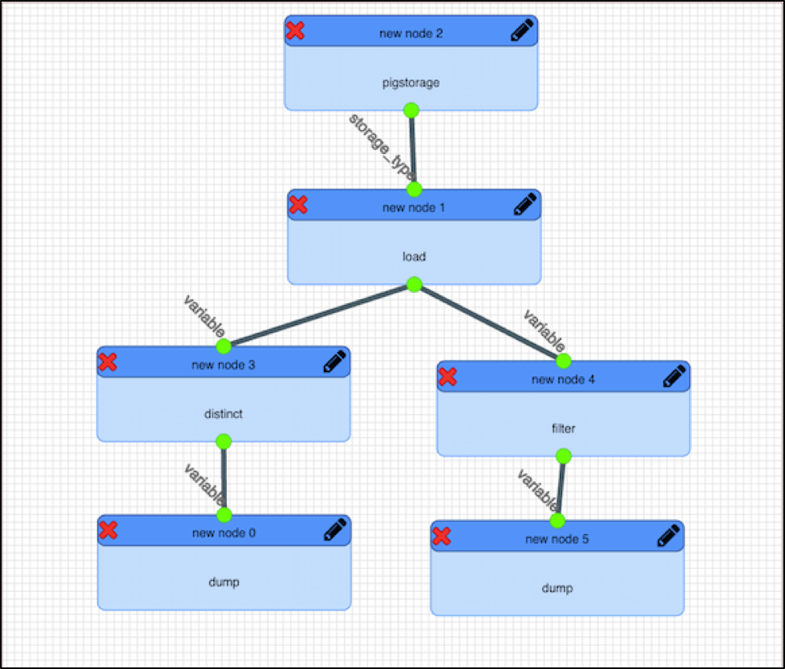
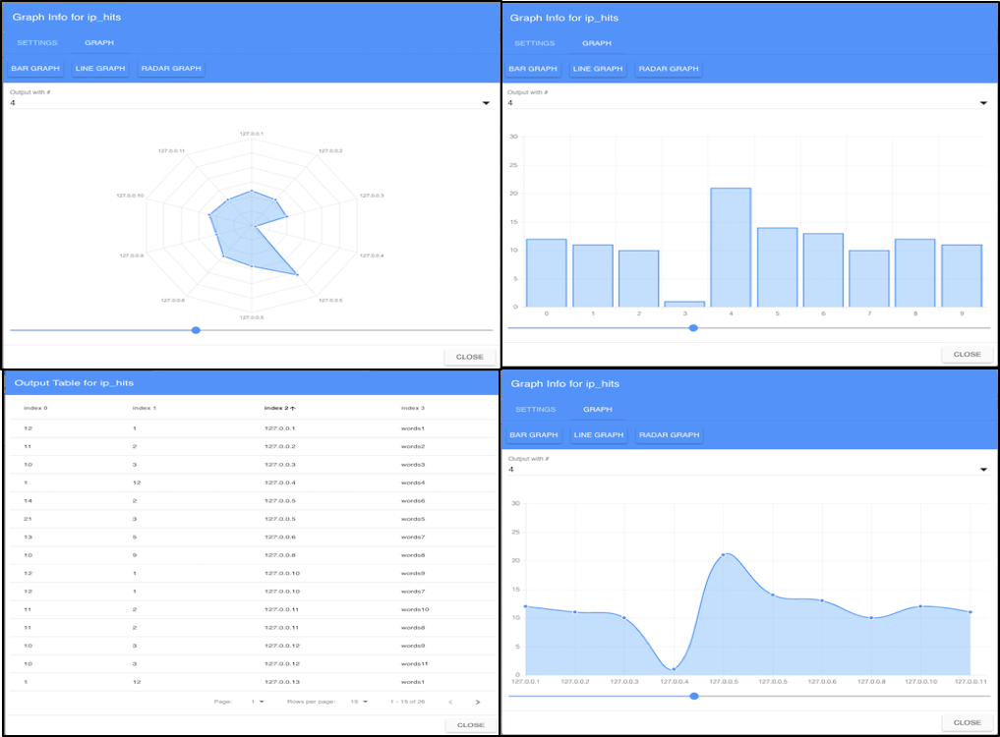
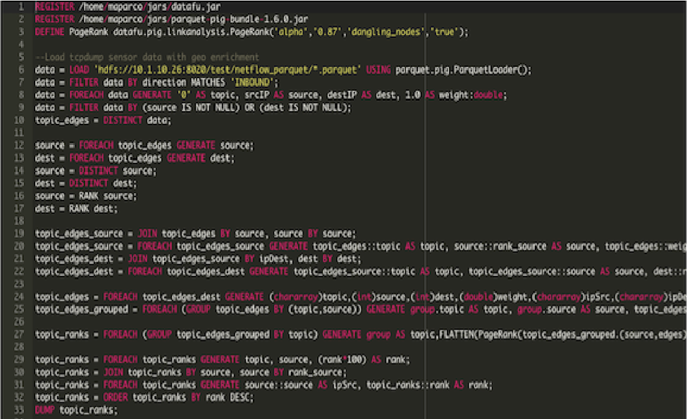

# Integrated Development Environment: “Hog”
---

# Introduction

Apache Pig has had a presence in the Open Source community for the better part
of a decade. In recent years, it has been a staple for programmers dealing with
Big Data and Cyber Analytics as it is highly efficient in analyzing large data
sets. Despite its popularity, however, there remains a shortage of professional
Pig developers in our customer space.

Enter Hog – an IDE that eliminates the need for developers with a specialization
in Pig. By utilizing the functionality of Apache Pig and displaying it in an
easily comprehensible UI, developers with little-to-no experience using Pig can
write codes that are comparable to those created by traditional Pig script
developers.

By bridging this knowledge gap between analytic developers writing Apache Pig
scripts and analysts wanting to manipulate their data through Pig, the pairing
of Apache Pig and Hog allows for less time and resources to be required to
develop quality Pig scripts.

# Simple Page

The Simple Page is the centerpiece of Hog. From this page, users can select the
node functions that they wish to apply to their data and modify the script using
a drag-and-drop interface. Hog provides a wide variety of nodes to choose from,
including Relational Operators, Eval Functions, Load Store Functions, Load
Types, Storage Types and Tuple Bag Map Functions. (A complete list of nodes
supported by Hog can be found in the Hog User Manual)

After creating the Pig script, users can run it and view the outputs in various
graph forms. Hog will classify the outputs into 5 categories: Results, Info
Logs, Warnings, Errors, and Graphs. If the user chooses, they may simply select
to show all outputs. In addition, the same settings that they used to create and
view their outputs and scripts will be saved and carried over throughout their
use of Hog.

For analysts who lack the ability to create Pig scripts from scratch, this page
will provide a simplistic way of not only manipulating their data, but also will
allow them to sort through various nodes and scripts through utilizing the List
feature. List will let the user see every script that they have created in Hog
and allow them to view, edit, or delete them.

This type of visualization has several benefits to an analyst just beginning to
learn Pig.

# Complex Page

Though the Simple Page was developed around the idea of helping a novice Pig
script writer, Hog benefits the experienced Pig script developer, as well. The
Complex Page is where analytic developers can write Pig scripts in a traditional
development environment while still taking advantage of Hog’s features.

Features of the Complex Page include autocomplete functions and colored font for
usability. Also, unlike the Simple Page, users may upload and download Pig
scripts to/from the Complex view.

Although the Complex Page is able to take scripts created in the Simple view and
modify them, the same cannot be said for the Simple Page. If the user uploads or
creates a script from the Complex Page, they currently cannot edit them in the
Simple view.

Editing through the Complex Page will also allow the developer to use the
Versioning tool. After an update to the script has been made, the user may
decide to update the version of the script, which would allow them to return to
that version of the script at any point in the future. This feature provides the
developer with a way to review older editions of their code, a useful option for
troubleshooting code.

Overall, developing Pig script through the Complex Page will allow developers to
use the full scope of Apache Pig, whether they initially wrote their script on
the Simple Page, Complex Page, or outside of the Hog application entirely.

# Hog as a Learning Tool

Besides the creation of the physical scripts that will be developed, the added
benefit which Hog provides is the ability for amateur analysts learning how to
write Pig in the traditional way.

Being able to toggle from the Simple view to the Complex view, users will be
able to utilize the drag-and-drop functionality, yet also be able to see the
scripts that they produce, allowing them to greater comprehend what it is that
they are creating and how it runs.

This type of application of Hog would mean more developers with an understanding
of Pig scripts. Eventually, users who began using the Simple page would be able
to graduate their writing of Pig scripts to being able to write scripts solely
in a traditional development environment: the Complex Page.

# End Result

Hog’s capabilities benefit all levels of Pig script developers, from those who
have expertise in the language to those who have never written a single script.

The Simple Page provides a shortcut for novice developers to learn Pig while
still producing fully functioning scripts. The Complex Page provides a
development environment for traditional Pig developers to work in, allows
scripts made in the Simple view to be tweaked, and helps those novice developers
garner a better understanding of Pig.

With the Hog application, Pig developers of all levels have a user friendly,
end-to-end solution for writing all of their Pig scripts.

